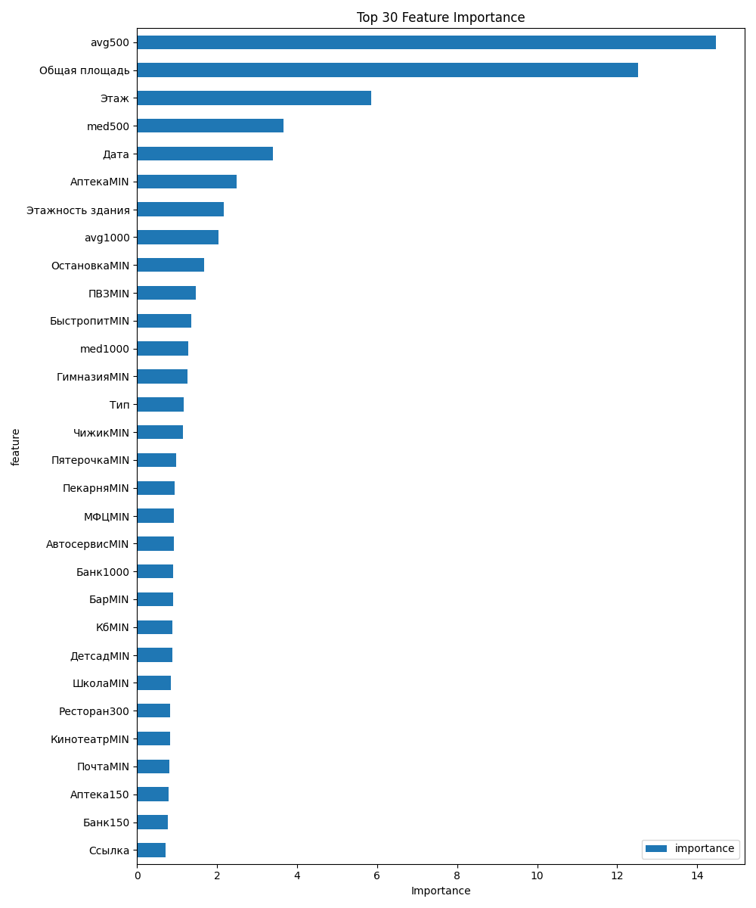

# Система автоматизированного поиска и оценки объектов коммерческой недвижимости для редевелопмента

## Что делает эта система?

Эта система разрабатывается для **фонда коммерческой недвижимости**, который занимается покупкой недооцененных объектов, их модификацией и последующей продажей по более высокой цене.

**Как это работает:**

Фонд ищет объекты коммерческой недвижимости, которые можно купить дешевле их реальной стоимости. Причины недооценки могут быть разные:

1. **Цена изначально ниже рыночной** — собственник не знает реальную стоимость объекта или хочет быстро продать
2. **Собственник не видит потенциал редевелопмента** — например, большой банк на "красной линии" можно выселить, разделить на 4 меньших помещения и заселить супермаркет, салон красоты, табачный киоск и т.д. Такие небольшие помещения часто сдаются дороже, чем одно большое
(как доказательство, вот график зависимости стоимости кв.м помещения от общей его площади)

*Примечание: График plot.png генерируется при анализе данных и не включен в репозиторий из-за размера.*

**Что делает система:**

- **Находит недооцененные объекты** — анализирует объявления с Авито и Циан, определяет, какие объекты стоят дешевле, чем должны
- **Предсказывает реальную стоимость** — использует машинное обучение, чтобы понять, сколько объект должен стоить на самом деле
- **Рассчитывает потенциал редевелопмента** — функция `split` пробует разделить большое помещение на несколько меньших (например, на 4 части) и считает, сколько можно заработать после такого разделения

**Пример:** Если большой банк площадью 300 м² стоит 10 млн рублей, система может предложить разделить его на 4 помещения по 75 м² каждое. После разделения эти помещения могут стоить уже 12-13 млн рублей вместе, что дает прибыль 2-3 млн рублей.

---

## Описание проекта

Система представляет собой программный комплекс для автоматизированного поиска, оценки инвестиционной привлекательности и прогнозирования доходности объектов коммерческой недвижимости. Разрабатываемый продукт позволяет агрегировать объявления с различных площадок, обогащать их данными об окружении и рассчитывать потенциал редевелопмента с использованием моделей машинного обучения.

### Назначение

Система предназначена для аналитической поддержки принятия решений при покупке коммерческой недвижимости. Основными функциями являются:

- **Прогнозирование справедливой стоимости** квадратного метра с использованием моделей машинного обучения
- **Расчет инвестиционного потенциала** при дроблении помещений на меньшие лоты
- **Анализ окружения объекта** (инфраструктура, конкуренты, жилой фонд)

### Целевая аудитория

Частные инвесторы, фонды коммерческой недвижимости (редевелоперы) и аналитики рынка.


Ссылка на гугл таблицу с предсказанными стоимостями и разбиениями помещений. Цветами вручную сделана фильтрация с выделением крутых объектов. Часть ссылок не работает(обычно это авито), тк датасет 2024(куплен в онлайн архиве, на 2025 данных не нашел для покупки. буду писать парсер).

https://docs.google.com/spreadsheets/d/1-vzVJxSeIWg6q6OC3vY7u6C60NBzKoFW0X2ve7d2HY8/edit?usp=sharing


---

## Текущий статус разработки (КТ2)

### Завершенные этапы

#### 1. Сбор и подготовка данных
- ✅ Собран датасет по объектам коммерческой недвижимости за 2023-2024 годы
- ✅ Источники данных: Авито (архивы), Циан
- ✅ Объем датасета: **22,000 объектов**
- ✅ Количество признаков: **~200 параметров** на объект

**Структура признаков:**
- **Базовые поля**: Цена, Дата, Район, Тип, Источник, Ссылка
- **Характеристики объекта**: Этаж, Этажность здания, Общая площадь, Вид объекта, Тип объявления
- **Окружение (радиусы 200/500 м)**: 
  - Жилой фонд (количество квартир, площадь, год постройки, количество домов)
  - POI (точки интереса): Аптеки, Банки, Школы, ВУЗы, Рестораны, Магазины и др. (26 типов)
  - Минимальные дистанции до ближайших POI
  - Агрегаты цен окружающей коммерческой недвижимости (avg500, avg1000, med500, med1000)

**Источники данных окружения:**
- Жилой фонд: МинЖКХ (https://dom.mingkh.ru/bashkortostan/ufa/houses)
- POI: Яндекс Карты (парсинг через Selenium)
- Агрегаты цен: расчет относительно ближайших объектов

#### 2. Разработка ML-модели
- ✅ Реализована модель **CatBoostRegressor** для прогнозирования стоимости
- ✅ Метрики качества:
  - **Полный датасет (200 признаков, 20000 объектов)**: R² = 0.74, RMSE = 0.76
  - **После очистки (150 признаков, 20000 объектов)**: R² = 0.73, RMSE = 0.75
- ✅ Реализован модуль анализа и очистки признаков (`clean_features.py`)

- ✅ Визуализация важности признаков (топ-30)

#### 3. Алгоритм оптимизации дробления помещений
- ✅ Реализован рекурсивный алгоритм поиска оптимального разделения помещений
- ✅ Учет ограничений: количество новых объектов, отдельные входы
- ✅ Расчет суммарной стоимости после дробления с учетом затрат на создание новых объектов

### Текущая стадия: Реализация ядра системы

**В работе:**
- Обучение финальной модели на очищенном датасете
- Оптимизация гиперпараметров модели
- Тестирование алгоритма дробления на реальных данных

**Планируется:**
- Реализация генерации отчетов в Excel/Google Sheets
- Разработка визуализаций (scatter plot, bar charts)
- Финальная сборка и тестирование системы

---

## Структура проекта

```
ML-main/
├── main.py                      # Основной скрипт обучения модели
├── config.py                    # Конфигурационные параметры
├── utils.py                     # Утилиты для обработки данных
├── clean_features.py            # Модуль анализа и очистки признаков
├── generate_split.py           # Алгоритм оптимизации дробления помещений
├── models/
│   ├── catboost_regressor.py   # Модель CatBoost для регрессии
│   └── linear_regression.py    # Альтернативная модель (Ridge)
├── data/
│   ├── result.pkl              # Основной датасет
│   ├── result_cleaned.pkl      # Очищенный датасет
│   └── data_control.py         # Скрипт контроля данных
└── README.md                    # Документация проекта
```

---

## Технические характеристики

### Требования к системе
- **Python**: версия 3.10 и выше
- **ОС**: Windows 10/11, macOS или Linux
- **RAM**: 8 Гб и выше (рекомендуется)
- **CPU**: 4 ядра и выше (для обучения модели)

### Используемые библиотеки
- `pandas` - манипуляция табличными данными
- `catboost` - библиотека градиентного бустинга
- `scikit-learn` - инструменты машинного обучения
- `matplotlib` - построение аналитических графиков
- `numpy` - численные вычисления

### Производительность
- Обучение модели на датасете 22,000 объектов: **~2-3 минуты**
- Предсказание стоимости одного объекта: **< 0.1 секунды**
- Оптимизация дробления одного объекта: **< 1 секунды**

---

## Установка

```bash
git clone https://github.com/153floppa/[название-репозитория].git
cd [название-репозитория]
pip install -r requirements.txt
```

**Требования:** Python 3.10 или выше. Датасеты уже включены в репозиторий в папке `data/`.

## Использование

### Обучение модели

```bash
python main.py
```

Скрипт выполняет:
1. Загрузку данных из `data/result.pkl`
2. Обучение модели CatBoost
3. Вывод важности признаков
4. Сохранение визуализации топ-30 признаков в `feature_importance.png`

### Анализ признаков

```bash
python clean_features.py
```

Модуль выполняет анализ признаков по критериям:
- Низкая важность (< 0.01% от общей)
- Низкая дисперсия (почти константные)
- Проблемные категориальные признаки
- Высокая корреляция между признаками (> 0.95)

Выводит полный список параметров с важностью и генерирует рекомендации по удалению признаков.

### Оптимизация дробления помещений

```python
from generate_split import split, score
from models.catboost_regressor import get_model
from utils import get_columns_grouped_by_dtypes
import pandas as pd

# Загрузка данных и модели
df = pd.read_pickle('data/result_cleaned.pkl')
model = get_model()
cat_cols = list(get_columns_grouped_by_dtypes(df)['object'])

# Оптимизация для конкретного объекта
obj = df.iloc[0]
result_price, new_objects = split(obj, model, cat_cols)

print(f"Исходная стоимость: {score(obj, model, cat_cols):.2f}")
print(f"Стоимость после дробления: {result_price:.2f}")
print(f"Количество новых помещений: {len(new_objects)}")
```

---

## Методология

### Модель машинного обучения

**Алгоритм**: CatBoost (Gradient Boosting)
- **Loss function**: RMSE
- **Evaluation metric**: R²
- **Разделение данных**: Train (50%) / Validation (30%) / Test (20%)
- **Early stopping**: 10 итераций без улучшения
- **Обработка категориальных признаков**: автоматическая через Pool

### Алгоритм оптимизации дробления

Рекурсивный перебор вариантов разделения помещения с учетом:
- Возможных площадей: [20, 30, 40, 60, 75, 100, 140, 250, 300] м²
- Ограничения на количество новых объектов: 3
- Ограничения на отдельные входы: 2
- Стоимость создания нового объекта: 10,000 руб.

Алгоритм максимизирует суммарную стоимость всех помещений после дробления.

---
## Результаты

### Метрики модели

| Датасет | Количество признаков | R² | RMSE | Итераций |
|---------|---------------------|-----|------|----------|
| Полный | 200 | 0.74 | 0.76 | 1667 |
| Очищенный | 150 | 0.73 | 0.75 | 1194 |

---

## Дальнейшее развитие

1. **Расширение функционала**:
   - Генерация отчетов в Excel с условным форматированием
   - Интеграция с Google Sheets API
   - Визуализация результатов (scatter plots, bar charts)

2. **Улучшение модели**:
   - Тюнинг гиперпараметров
   - Эксперименты с ансамблями моделей
   - Добавление временных признаков (тренды цен)

3. **Автоматизация**:
   - Регулярное обновление данных (парсинг новых объявлений)
   - Автоматический retraining модели (раз в месяц)
   - Мониторинг качества предсказаний

---

## Контакты и лицензия

Проект разрабатывается в рамках курсовой работы по направлению "Программная инженерия" НИУ ВШЭ.

**Статус**: В разработке (КТ2 - промежуточная контрольная точка)

---

## Примечания

- Данные по аренде преобразованы: годовая аренда × 10 (по согласованию с собственниками)
- Некоторые параметры (например, "отопление") были удалены из-за большого количества пропусков
- Модель обучена на данных по г. Уфа (Башкортостан)
